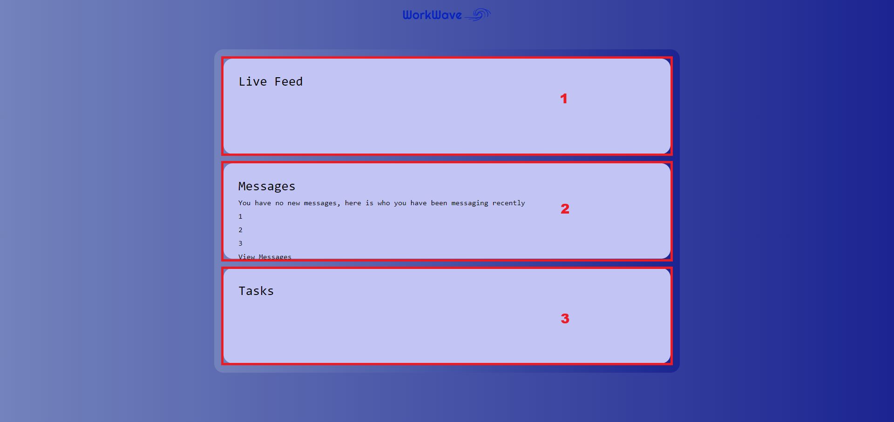
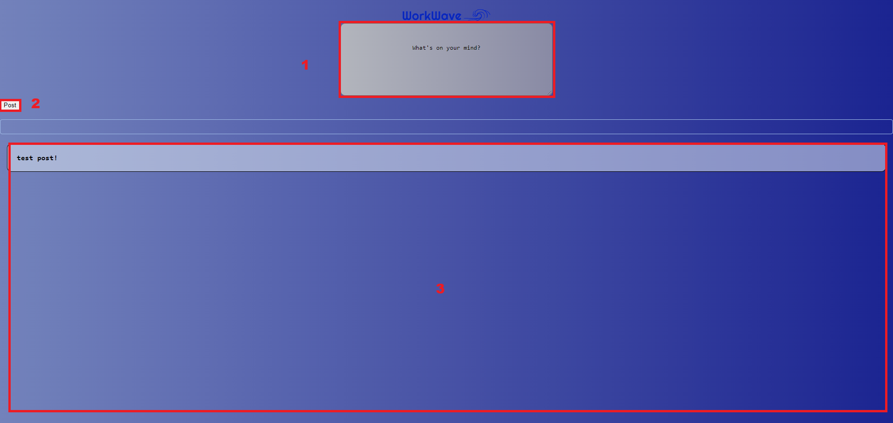
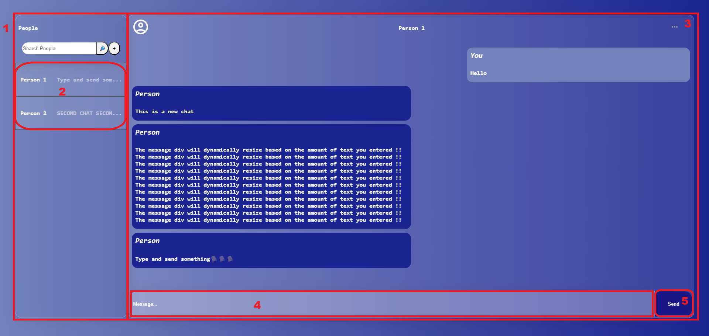

==========
Usage
==========

.. note::
   Update images/ usage (if there are new features) when the application is complete.

Below are the core features of this application, and how to use them:

Profile and Authentication
----------

Initially, users will arrive at the login page that will ask for their **username** and **password**. Succesfully entering the correct username and password on the associated fields will redirect the user to the dashboard page and will log them in.
Every password is encrypted before stored into the database. Users can also logout of their account.

* 1. **Username Input Box** - Enter your **username** here.
* 2. **Password Input Box** - Enter your **password** here.
* 3. **Login Button** - Once both the **username** and **passwords** are entered, click here to login. This will redirect you to the **dashboard page**.
* 4. **Forgot Password** - Click here if you have forgotten your password.

.. image:: images/login.png
   :alt: image of login page
   :width: 50%
   :height: 50%

Dashboard
----------
Upon a successful login, users will be redirected to the dashboard page. 
It is the central hub of the application, and will display a brief summary of every part of the app; the live feed, recent messages with collegues and the user's current tasks.

* 1. **Live Feed Section** - This section will display the most recent posts from all users within the company.
   #. Clicking on the Live Feed Header will redirect the user to the live feed page.
* 2. **Messages Section** - This section will display the most recent messages from collegues.
   #. Clicking on the Messages Header will redirect the user to the messaging page.
* 3. **Tasks Section** - This section will display the most recent tasks that the user has been assigned.
   #. Clicking on the Tasks Header will redirect the user to the tasks page.

**Hovering over each section will display a brief summary of each of the contents of the pages.**

By clicking on:
* **Live Feed** - users will be redirected to the live feed page.
* **Messages** - users will be redirected to the messaging page.

Live Feed
----------
The live feed will display the most recent posts from all users within the company. Users can post their own text updates, and view updates from their collegues.

* 1. **Post Input Box** - Click here to input text for your post.
* 2. **Post Button** - Once text has been inputted in the **Input Box**, Clicking post will send it to the live feed.
* 3. **Live Feed** - This is where all the posts made by you and other users will be displayed.

Messaging
----------
Users will be able to send messages to their collegues. The messages will be displayed in a chat-like format, with the most recent messages appearing at the bottom of the chat box.
Conversations will be displayed in a list to the left hand side of the chat box, and users can click on each conversation to view the messages.

* 1. **Conversations Box** - All of your conversation with other users will be displayed here.
* 2. **Individual Conversations Box** - Each conversation you have with a specific user will appear here. Click on the conversation to view the messages in the chat box.
* 3. **Chat Box** - All of the messages in the selected conversation will be displayed here.
   #. Your messages will be displayed on the right hand side of the chat box.
   #. Your collegues messages will be displayed on the left hand side of the chat box.
* 4. **Message Input Box** - Click here to input text for your message.
* 5. **Send Button** - Once text has been inputted in the **Message Input Box**, Clicking send will send it to the chat box.

